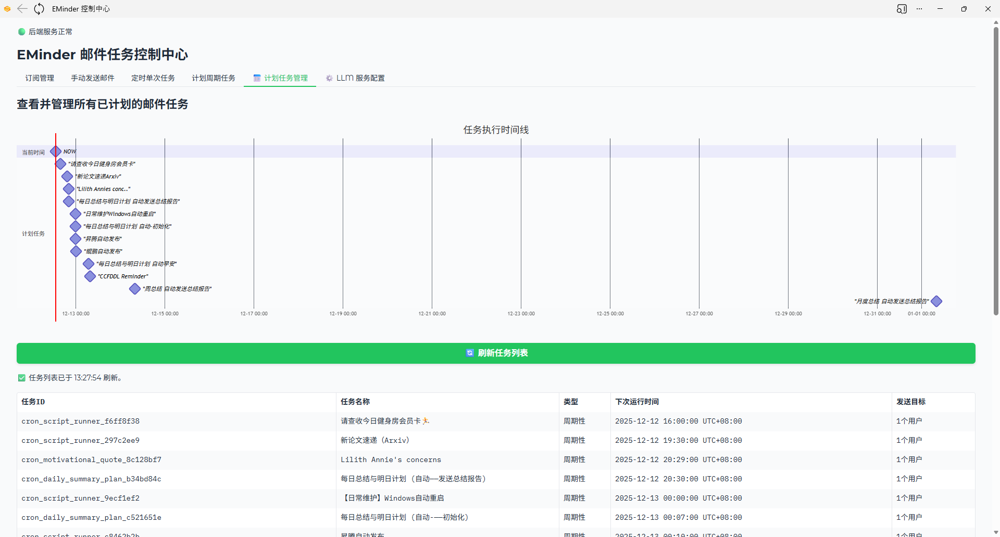

# EMinder ✨

<div align="center">

*A flexible, template-driven email scheduling and sending toolkit with integrated AI capabilities.*  
*一个集成了 AI 功能的、灵活的、模板驱动的邮件定时发送工具包。*
<p align="center">
  
  
  
  
  
</p>



</div>

You can run EMinder in one click with Conda!  
您可以用 Conda 一键启动 EMinder！

> Windows：  
Clone the repository and run the `one_click_start_windows.bat` script.  
克隆本项目，并运行 `one_click_start_windows.bat` 脚本。

> Linux：  
Clone the repository and run the `bash one_click_start_linux.sh` in the project directory.  
克隆本项目，并在项目目录下运行 `bash one_click_start_linux.sh`。

# Manual of EMinder 使用手册
<p align="center">
  <a href="#english">English</a> •
  <a href="#中文">中文</a>
</p>

---

<a name="english"></a>

## 🇬🇧 English

<details>
<summary><strong>Table of Contents</strong></summary>

- [EMinder ✨](#eminder-)
- [Manual of EMinder 使用手册](#manual-of-eminder-使用手册)
  - [🇬🇧 English](#-english)
    - [About The Project](#about-the-project)
    - [Key Features](#key-features)
    - [Tech Stack](#tech-stack)
    - [Project Structure](#project-structure)
    - [Getting Started](#getting-started)
      - [Prerequisites](#prerequisites)
      - [Installation \& Setup](#installation--setup)
    - [Usage](#usage)
    - [How to Customize a New Template](#how-to-customize-a-new-template)
    - [Roadmap](#roadmap)
    - [Contributing](#contributing)
    - [License](#license)
  - [🇨🇳 中文](#-中文)
    - [关于项目](#关于项目)
    - [核心功能](#核心功能)
    - [技术栈](#技术栈)
    - [项目结构](#项目结构)
    - [开始使用](#开始使用)
      - [先决条件](#先决条件)
      - [安装与配置](#安装与配置)
    - [如何使用](#如何使用)
    - [如何自定义一个新模板](#如何自定义一个新模板)
    - [未来蓝图 (TODO)](#未来蓝图-todo)
    - [如何贡献](#如何贡献)
    - [许可证](#许可证)

</details>

### About The Project

**EMinder** is a powerful tool designed to automate sending personalized and templated emails. Whether you need to send AI-powered daily summaries, weekly project reports, or logs from automated scripts, EMinder provides a flexible and extensible solution.

The project features a decoupled architecture with a **FastAPI** backend for robust API services and a **Gradio** frontend for an intuitive web-based control panel. It uses **SQLite** to persist subscriber data, scheduled jobs, and now **LLM (Large Language Model) service configurations**, ensuring no data is lost upon restart.

### Key Features

-   📧 **Dynamic Templates**: The UI is dynamically generated based on template metadata. Adding new email templates is as simple as creating a Python file—no frontend code changes required!
-   💾 **Persistent Storage**: Uses SQLite to store subscriber lists, scheduled tasks, and LLM configurations, ensuring data durability across application restarts.
-   ⏰ **Flexible Scheduling**: Supports both recurring tasks (via Cron expressions) and one-off scheduled emails for a specific future time.
-   🖥️ **Interactive Web UI**: A user-friendly Gradio control panel to manage subscribers, schedule tasks, and view/cancel all pending jobs.
-   <!-- ========================== START: MODIFICATION ========================== -->
-   🧠 **Pluggable AI Providers**: Configure and manage multiple LLM services (like DeepSeek, Kimi, SiliconFlow, etc.) directly from the Web UI. Add, edit, delete, and switch the active service on the fly without touching any code or environment variables.
-   🤖 **Intelligent Workflows**: Leverage powerful built-in templates, such as the "Daily Summary & Plan" which automatically archives yesterday's report, migrates plans, and uses AI to generate a summary for the current day.
-   🔩 **Script Execution Engine**: A unique template allows you to schedule the execution of any shell command or script. EMinder captures the output (stdout/stderr), attaches any files generated by the script, and can even use an LLM to summarize the execution log before emailing the result.
-   🔇 **Silent Run Mode**: Execute a task's logic (like running a script or archiving a file) without actually sending the email, perfect for debugging or running silent operations.
-   <!-- ========================== END: MODIFICATION ============================ -->
-   🔧 **Decoupled & Scalable**: A clean separation between the FastAPI backend and the Gradio frontend makes the project easy to maintain and scale.
-   📤 **Multi-Source Senders**: Configure and use multiple sender email accounts. The system will rotate through them for sending.
-   🚫 **Pydantic-Free**: Built entirely without the `pydantic` library.

### Tech Stack

-   **Backend**: Python, FastAPI, Uvicorn, APScheduler, SQLAlchemy
-   **Frontend**: Gradio
-   **Database**: SQLite (for subscribers, job persistence, and LLM settings)
-   **Dependencies**: python-dotenv, aiosmtplib, httpx, markdown, croniter

### Project Structure

```
EMinder/
├── backend/
│   ├── app/
│   │   ├── api/              # API endpoints (subscribers, templates, jobs, llm)
│   │   ├── core/             # Configuration (config.py) and logging (logging_config.py)
│   │   ├── services/         # Business logic (email, scheduling, llm, script_runner)
│   │   ├── storage/          # Data storage (sqlite_store.py)
│   │   ├── templates/        # Email template definitions
│   │   │   ├── email_templates.py    # Main template manager
│   │   │   └── customize_templates.py  # User-defined custom templates
│   │   └── main.py           # FastAPI application entry point
│   ├── logs/                 # Log files will be created here
│   ├── temp_uploads/         # Temporary storage for file uploads
│   ├── run.py                # Script to run the backend
│   └── .env                  # Environment variables (!!! IMPORTANT !!!)
├── frontend/
│   ├── app/
│   │   ├── api_client.py     # Handles all communication with the backend API
│   │   ├── config.py         # Frontend configuration and argument parsing
│   │   ├── handlers.py       # Gradio event callback functions
│   │   ├── main.py           # Main application logic and UI wiring
│   │   ├── state.py          # Shared application state
│   │   └── ui.py             # UI component and layout definitions
│   └── run.py                # Entry point script to run the frontend
└── requirements.txt          # Python dependencies
```

### Getting Started

Follow these steps to get a local copy up and running.

#### Prerequisites

- **Git**: To clone the repository.
- **Conda / Miniconda**: To manage the Python environment.
- **Python 3.9** or newer.

#### Installation & Setup

1.  **Clone the repository**
    ```sh
    git clone https://github.com/JulianRyder01/EMinder.git
    cd EMinder
    ```

2.  **Create and activate the Conda environment**
    ```sh
    # Create an environment named 'EMinder_service' with Python 3.9
    conda create --name EMinder_service python=3.9 -y

    # Activate the environment
    conda activate EMinder_service
    ```

3.  **Install dependencies**
    ```sh
    pip install -r requirements.txt
    ```

4.  **Configure Environment Variables**
    -   Navigate to the `backend/` directory.
    -   Create a file named `.env` from scratch or by copying `.env.example`.
    -   Open `.env` and fill in your details. **This step is crucial.**

    ```ini
    # backend/.env

    # --- SMTP Server Configuration ---
    # Format: email1|app_password1,email2|app_password2
    SENDER_ACCOUNTS="your_email@example.com|your_app_specific_password"

    SMTP_SERVER="smtp.example.com"
    SMTP_PORT=465

    # --- Application Configuration ---
    # The base URL of the backend service itself.
    APP_BASE_URL="http://127.0.0.1:8421"

    # --- Database Configuration ---
    # The database file will be created relative to the `backend` directory.
    DATABASE_URL="sqlite:///./eminder.db"
    
    # --- Daily/Weekly/Monthly Summary Feature Path ---
    # Provide the ABSOLUTE path to the folder where you store your daily summary Markdown files.
    # Windows example: DAILY_SUMMARY_PATH="C:\Users\YourUser\Documents\DailySummaries"
    # Linux/macOS example: DAILY_SUMMARY_PATH="/home/YourUser/Documents/DailySummaries"
    DAILY_SUMMARY_PATH="C:\Path\To\Your\DailySummary"

    # NOTE: LLM (e.g., DeepSeek) API keys are no longer configured here.
    # They are now managed dynamically via the Web UI in the "LLM Service Configuration" tab.
    ```
    <!-- ========================== END: MODIFICATION ============================ -->

5.  **Run the Application**
    -   **Start the Backend** (in a new terminal):
        ```sh
        # From the project root, run:
        cd backend
        python run.py --port 8421
        ```
    -   **Start the Frontend** (in a **second** terminal):
        ```sh
        # From the project root, run:
        cd frontend
        python run.py --port 10101 --bnport 8421
        ```

### Usage

Once both services are running, open your web browser and navigate to:

**`http://127.0.0.1:10101`**

You will see the EMinder Control Center with six tabs:
1.  **Subscription Management**: Add, view, edit, and delete subscribers.
2.  **Manual Send**: Immediately send a templated email. The form fields are built dynamically based on your chosen template.
3.  **Scheduled One-off Task**: Schedule an email to be sent at a specific future date and time.
4.  **Scheduled Cron Task**: Create a recurring task using a Cron expression.
5.  **Scheduled Jobs Management**: View all pending tasks. You can cancel any task by its ID, trigger it to run immediately, or edit its parameters.
6.  **LLM Service Configuration**: Add, edit, delete, and set the active Large Language Model service for AI-powered templates.

### How to Customize a New Template

Adding your own email template is incredibly simple and requires **no changes to the frontend code**.

1.  **Open the Custom Template File**: Navigate to `backend/app/templates/customize_templates.py`.

2.  **Define Metadata**: Create a dictionary that describes your template. This tells the UI what fields to show.
    -   `display_name`: The name shown in the dropdown menu.
    -   `description`: A short explanation of the template's purpose.
    -   `fields`: A list of input fields, where each field is a dictionary containing `name` (internal variable), `label` (UI display text), `type` (`text`, `textarea`, or `number`), and `default` value.

3.  **Write the Template Function**: Create a Python function that takes a dictionary (`data`) of the user's input and returns a dictionary with the email's `subject` and `content` (HTML).

4.  **Register Your Template**: Add your new template's metadata and function to the `custom_templates` dictionary at the bottom of the file.

5.  **Enable Your Template**: In `backend/app/templates/email_templates.py`, uncomment the following line at the top of the file:
    ```python
    from .customize_templates import custom_templates
    ```

6.  **Restart the Backend**: Rerun the backend server. Your new template will now automatically appear in the UI, ready to use!

### Roadmap

-   [ ] **Dynamic Data Sources**: Fetch user-specific data from an external API or database before sending an email.
-   [ ] **User Authentication**: Add a login system to protect the control panel.
-   [ ] **Containerization**: Provide `Dockerfile` and `docker-compose.yml` for easy deployment.
-   [ ] **Comprehensive Testing**: Add unit and integration tests for the backend services.

### Contributing

Contributions are what make the open-source community such an amazing place to learn, inspire, and create. Any contributions you make are **greatly appreciated**.

1.  Fork the Project
2.  Create your Feature Branch (`git checkout -b feature/AmazingFeature`)
3.  Commit your Changes (`git commit -m 'Add some AmazingFeature'`)
4.  Push to the Branch (`git push origin feature/AmazingFeature`)
5.  Open a Pull Request

Please also feel free to open an issue for any bugs or feature requests.

### License

Distributed under the MIT License. See `LICENSE` file for more information.

---

<a name="中文"></a>

## 🇨🇳 中文

<details>
<summary><strong>目录</strong></summary>

- [关于项目](#关于项目)
- [核心功能](#核心功能)
- [技术栈](#技术栈)
- [项目结构](#项目结构)
- [开始使用](#开始使用)
  - [先决条件](#先决条件)
  - [安装与配置](#安装与配置)
- [如何使用](#如何使用)
- [如何自定义一个新模板](#如何自定义一个新模板)
- [未来蓝图 (TODO)](#未来蓝图-todo)
- [如何贡献](#如何贡献)
- [许可证](#许可证)

</details>

### 关于项目

**EMinder** 是一款强大的工具，旨在自动化发送个性化的、基于模板的电子邮件。无论您需要发送由 AI 驱动的每日总结、每周项目报告，还是自动化脚本的执行日志，EMinder 都提供了一个灵活且可扩展的解决方案。

项目采用前后端分离架构，后端使用 **FastAPI** 提供稳健的 API 服务，前端则使用 **Gradio** 构建了一个直观的 Web 控制面板。它使用 **SQLite** 来持久化存储订阅者数据、计划任务以及现在的 **LLM（大语言模型）服务配置**，确保在服务重启后数据不会丢失。

### 核心功能

-   📧 **动态模板**: UI界面完全根据模板的元数据动态生成。添加新邮件模板就像创建一个Python文件一样简单——无需修改任何前端代码！
-   💾 **持久化存储**: 使用 SQLite 存储订阅者列表、计划任务和 LLM 配置，确保了在应用重启之间的数据持久性。
-   ⏰ **灵活调度**: 同时支持周期性任务（通过 Cron 表达式）和为未来特定时间点安排的一次性邮件。
-   🖥️ **交互式 Web UI**: 一个用户友好的 Gradio 控制面板，用于管理订阅者、安排任务，以及查看/取消所有待处理的任务。
-   🧠 **可插拔的 AI 服务**: 直接通过 Web 界面配置和管理多个 LLM 服务（如 DeepSeek, Kimi, 硅基流动等）。无需修改任何代码或环境变量，即可随时添加、编辑、删除和切换当前激活的服务。
-   🤖 **智能工作流**: 利用强大的内置模板，例如“每日总结与计划”，它能自动归档昨天的报告、迁移计划，并使用 AI 为当天生成总结。
-   🔩 **脚本执行引擎**: 一个独特的模板允许您调度执行任何 Shell 命令或脚本。EMinder 会捕获其输出（标准输出/标准错误），附加脚本生成的任何文件，甚至可以在发送邮件前使用 LLM 总结执行日志。
-   🔇 **静默运行模式**: 可执行任务的内部逻辑（如运行脚本、归档文件），但实际上不发送邮件。非常适合用于调试或执行静默操作。
-   🔧 **解耦与可扩展**: FastAPI 后端和 Gradio 前端清晰分离，使得项目易于维护和扩展。
-   📤 **多源发信**: 支持配置和使用多个发件人邮箱账户，系统会在发送时进行轮换。
-   🚫 **无 Pydantic 依赖**: 项目完全不使用 `pydantic` 库进行构建。

### 技术栈

-   **后端**: Python, FastAPI, Uvicorn, APScheduler, SQLAlchemy
-   **前端**: Gradio
-   **数据库**: SQLite (用于订阅者、任务持久化和LLM设置)
-   **依赖库**: python-dotenv, aiosmtplib, httpx, markdown, croniter

### 项目结构

项目遵循模块化的结构，以实现更好的组织和可维护性。

```
EMinder/
├── backend/
│   ├── app/
│   │   ├── api/              # API 端点 (订阅者, 模板, 任务, LLM)
│   │   ├── core/             # 配置 (config.py) 和日志 (logging_config.py)
│   │   ├── services/         # 业务逻辑 (邮件, 调度, LLM, 脚本执行)
│   │   ├── storage/          # 数据存储 (sqlite_store.py)
│   │   ├── templates/        # 邮件模板定义
│   │   └── main.py           # FastAPI 应用入口
│   ├── logs/                 # 日志文件将在此创建
│   ├── temp_uploads/         # 文件上传的临时存储
│   ├── run.py                # 运行后端的脚本
│   └── .env                  # 环境变量文件 (!!! 非常重要 !!!)
├── frontend/
│   ├── app/
│   │   ├── api_client.py     # 处理所有与后端API的通信
│   │   ├── config.py         # 前端配置与参数解析
│   │   ├── handlers.py       # Gradio 事件回调函数
│   │   ├── main.py           # 主应用逻辑与UI连接
│   │   ├── state.py          # 共享的应用状态
│   │   └── ui.py             # UI组件与布局定义
│   └── run.py                # 运行前端的入口脚本
└── requirements.txt          # Python 依赖
```

### 开始使用

按照以下步骤在您的本地环境中部署和运行项目。

#### 先决条件

-   **Git**: 用于克隆本仓库。
-   **Conda / Miniconda**: 用于管理 Python 环境。
-   **Python 3.9** 或更高版本。

#### 安装与配置

1.  **克隆仓库**
    ```sh
    git clone https://github.com/JulianRyder01/EMinder.git
    cd EMinder
    ```

2.  **创建并激活 Conda 环境**
    ```sh
    # 创建一个名为 EMinder_service，使用 Python 3.9 的环境
    conda create --name EMinder_service python=3.9 -y

    # 激活环境
    conda activate EMinder_service
    ```

3.  **安装依赖**
    ```sh
    pip install -r requirements.txt
    ```

4.  **配置环境变量**
    -   进入 `backend/` 目录。
    -   根据以下 example 创建一个 `.env` 文件。
    -   打开 `.env` 文件并填入您的信息。**此步骤至关重要。**

    ```ini
    # backend/.env

    # --- SMTP 服务器配置 ---
    # 格式: 邮箱1|授权码1,邮箱2|授权码2
    # 请使用您邮箱服务商提供的“应用专用授权码”，而不是您的登录密码！
    SENDER_ACCOUNTS="your_email@example.com|your_app_specific_password"

    SMTP_SERVER="smtp.example.com"
    SMTP_PORT=465

    # --- 应用配置 ---
    APP_BASE_URL="http://127.0.0.1:8000"

    # --- 数据库配置 ---
    # 数据库文件将创建在 `backend` 目录下
    DATABASE_URL="sqlite:///./eminder.db"

    # --- 调度器配置 ---
    # 用于每日周期性邮件的 Cron 表达式 (分 时 日 月 周)
    DAILY_SUMMARY_CRON="0 8 * * *" # 每天早上 8:00
    ```

5.  **运行应用**
    -   **启动后端** (在一个新终端中):
        ```sh
        # 在项目根目录执行
        cd backend
        python run.py --port 8421
        ```
    -   **启动前端** (在 **第二个** 终端中):
        ```sh
        # 在项目根目录执行
        cd frontend
        python run.py --port 10101 --bnport 8421
        ```

### 如何使用

当两个服务都成功运行后，打开您的浏览器并访问：

**`http://127.0.0.1:10101`**

您将看到 EMinder 控制中心，它包含六个选项卡：
1.  **订阅管理**: 添加、查看、编辑和删除订阅者。
2.  **手动发送**: 立即发送一封模板邮件。表单中的字段会根据您选择的模板动态生成。
3.  **定时单次任务**: 安排一封邮件，在未来的某个特定日期和时间发送。
4.  **计划周期任务**: 使用 Cron 表达式创建一个重复执行的任务。
5.  **计划任务管理**: 查看所有待处理的任务。您可以根据任务ID取消任何任务、立即触发一次，或对其进行编辑。
6.  **LLM 服务配置**: 添加、编辑、删除和设置当前激活的、用于AI模板的大语言模型服务。
<!-- ========================== END: MODIFICATION ============================ -->

### 如何自定义一个新模板

添加您自己的邮件模板非常简单，并且**无需修改任何前端代码**。

1.  **打开自定义模板文件**: 导航到 `backend/app/templates/customize_templates.py`。这个文件是为您创建自定义模板而设计的起点。

2.  **定义元数据**: 创建一个字典来描述您的模板，它会告诉UI界面需要显示哪些输入框。
    -   `display_name`: 在下拉菜单中显示的名称。
    -   `description`: 关于模板用途的简短描述。
    -   `fields`: 一个输入字段列表，每个字段都是一个字典，包含 `name` (内部变量名)、`label` (UI显示的标签)、`type` (`text`、`textarea` 或 `number`) 和 `default` (默认值)。

3.  **编写模板函数**: 创建一个Python函数，它接收用户输入的字典 (`data`)，并返回一个包含邮件 `subject` (主题) 和 `html` (内容) 的字典。
    -   **新功能**: 如果您的函数需要执行 I/O 操作（例如调用 `llm_service` 或 `script_runner_service`），可以将其定义为 `async def`。
    -   **新功能**: 您的函数还可以返回 `attachments` (一个包含文件路径的列表)，以将文件作为附件发送。

4.  **注册你的模板**: 将您的新模板添加到 `custom_templates` 字典中。

5.  **启用你的模板**: 在 `backend/app/templates/email_templates.py` 文件中，确保 `from .customize_templates import custom_templates` 这一行的注释已被移除。

6.  **重启后端服务**: 重新运行后端服务。您的新模板现在会自动出现在UI界面中！

### 未来蓝图 (TODO)

-   [ ] **动态数据源**: 在发送邮件前，从外部 API 或数据库中获取用户专属数据。
-   [ ] **用户认证**: 为控制面板添加登录系统以保护其安全。
-   [ ] **容器化**: 提供 `Dockerfile` 和 `docker-compose.yml` 文件，以便通过 Docker 轻松部署。
-   [ ] **全面的测试**: 为后端服务添加单元测试和集成测试。

### 如何贡献

我们欢迎任何形式的贡献，无论是报告 BUG、提出新功能建议，还是提交代码。您的每一次贡献都将使这个社区变得更加美好。

1.  Fork 本项目
2.  创建您的功能分支 (`git checkout -b feature/AmazingFeature`)
3.  提交您的更改 (`git commit -m 'Add some AmazingFeature'`)
4.  将分支推送到您的 Fork (`git push origin feature/AmazingFeature`)
5.  创建一个 Pull Request

### 许可证

本项目采用 MIT 许可证。详情请参阅 `LICENSE` 文件。